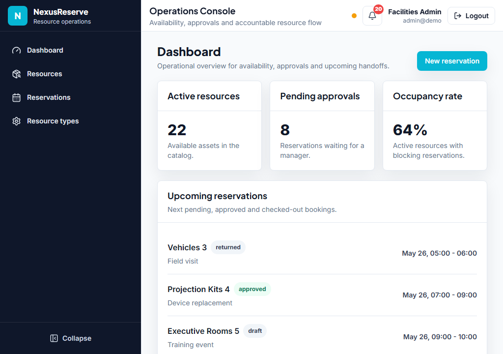
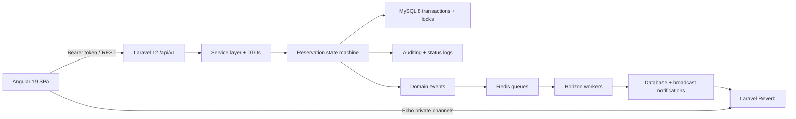
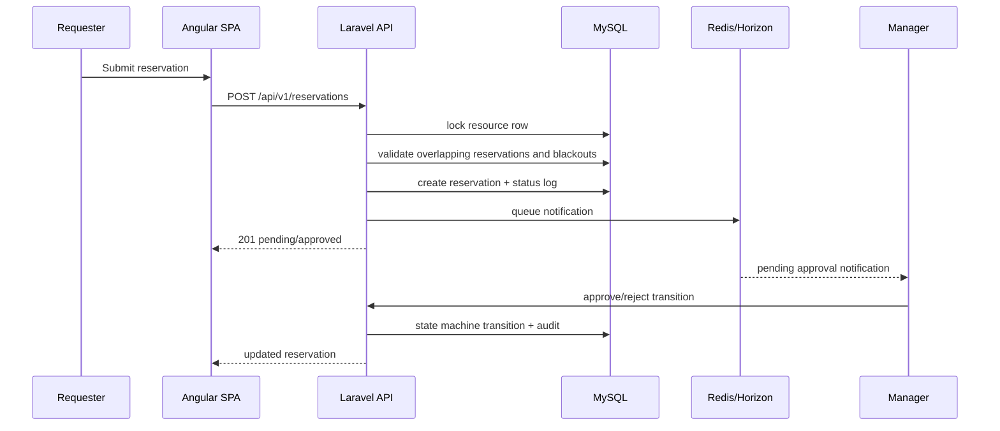
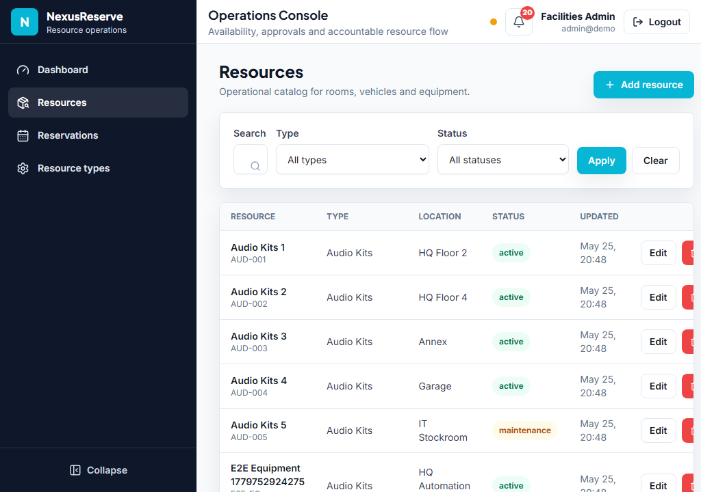
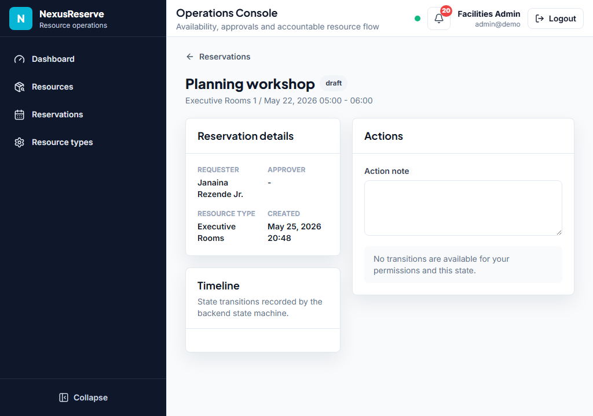

# NexusReserve

NexusReserve is an enterprise-grade resource reservation platform for internal assets such as rooms, vehicles, equipment and notebooks. It is built as a senior portfolio project: real business rules, transactional conflict prevention, RBAC, auditability, realtime updates, queues, documented architecture decisions and a production-oriented Docker path.



## Architecture



### Data Flow



## Why This Stack

| Layer | Choice | Why it matters |
|---|---|---|
| Backend | Laravel 12 / PHP 8.3 | Mature enterprise patterns, queues, policies, validation and testing support |
| API | REST `/api/v1` + API Resources | Stable contract for the SPA and future clients |
| Auth/RBAC | Sanctum + spatie/laravel-permission | Simple SPA auth with granular business permissions |
| State | spatie/laravel-model-states | Explicit reservation lifecycle and invalid transition protection |
| Data | MySQL 8 | Relational integrity, transactional locks and operational familiarity |
| Async | Redis + Horizon | Durable notification and realtime work without blocking requests |
| Realtime | Laravel Reverb + Echo | First-party WebSocket stack with private/presence channel authorization |
| Frontend | Angular 19 standalone + signals | Typed, modular SPA with guards, interceptors and reactive UX |
| UI | TailwindCSS + lucide-angular | Clean enterprise interface aligned with the project brand kit |
| Tests | Pest, Jest, Playwright | Backend rules, frontend behavior and end-to-end user paths |
| Infra | Docker Compose | Reproducible local stack and production-oriented build profile |

## Critical Business Rules

- A resource cannot have overlapping reservations in `pending`, `approved` or `checked_out`.
- Time intervals are half-open: `[starts_at, ends_at)`.
- Reservations cannot overlap a `ResourceBlackout`.
- Conflict validation runs inside a DB transaction after `lockForUpdate` on the resource row.
- Backend is the source of truth; the frontend only previews likely availability.
- Reservation transitions are constrained by the state machine and logged in `reservation_status_logs`.
- Resource and reservation changes are auditable.

## Security And Hardening

- JSON error contract for API failures: `{ message, code, errors? }`.
- Security headers middleware: `nosniff`, `DENY` frame policy, referrer policy, permissions policy and HSTS on HTTPS.
- Rate limits on login, mutating API routes and broadcasting auth.
- Private/presence Reverb channels authorize through Sanctum and Spatie permissions.
- Tokens are kept in Angular memory, not `localStorage`.
- CORS explicitly covers `/api/*`, `/sanctum/csrf-cookie` and `/broadcasting/auth`.
- Secrets are not committed; production compose requires environment injection.

## Screenshots





## Setup

Development stack:

```bash
docker compose up -d --build
```

URLs:

| Service | URL |
|---|---|
| Frontend | http://localhost:4200 |
| Backend API | http://localhost:8000/api/v1 |
| Reverb | ws://localhost:8080 |
| MySQL | localhost:3306 |
| Redis | localhost:6379 |

Demo users:

| Role | Email | Password |
|---|---|---|
| Admin | admin@demo | password |
| Manager | manager@demo | password |
| Requester | requester@demo | password |

## Production-Like Docker

Production profile:

```bash
docker compose -f docker-compose.prod.yml up -d --build
```

The production profile builds Angular once and serves it through Nginx, runs Laravel behind PHP-FPM, runs a separate Nginx API edge, and keeps Horizon/Reverb as isolated processes. Required production variables are documented in [backend/.env.production.example](backend/.env.production.example) and [docker/prod/README.md](docker/prod/README.md).

## Quality Gates

Backend:

```bash
cd backend
./vendor/bin/pest
./vendor/bin/pint --test
composer audit
```

The `1 skipped` in the backend suite is intentional: it is the MySQL concurrency
proof (two forked processes competing for the same slot under `lockForUpdate`),
gated behind an env var because it needs a real MySQL and `pcntl`. Run it with:

```bash
docker compose exec -e RUN_MYSQL_CONCURRENCY_TESTS=1 backend \
  ./vendor/bin/pest tests/Feature/ReservationConcurrencyTest.php
```
See ADR-19 for rationale.


Frontend:

```bash
cd frontend
npm run lint
npm run test
npm run test:coverage
npm run build
npm run e2e
npm audit
```

`npm audit` reports high/moderate **transitive** advisories from the build
toolchain (Lighthouse → puppeteer-core → proxy-agent chain). No non-breaking
fix is available and none affects the production runtime (build/dev tooling only).
Re-evaluated on each Angular upgrade.

## Architecture Decisions

The full decision log lives in [docs/DECISIONS.md](docs/DECISIONS.md). Highlights:

- Monorepo with Docker keeps API, SPA and infrastructure versioned together.
- Jest replaces Karma for faster Angular unit tests.
- Reservation lifecycle uses a state machine plus status log table.
- Conflict detection uses MySQL transaction + `lockForUpdate` because MySQL lacks native exclusion constraints.
- Filters live in the URL to support shareable operational views.
- Realtime uses Reverb private/presence channels with authorization, not public broadcasts.
- Notifications are persisted in the database and broadcast in realtime.
- Production Docker separates Angular static serving, PHP-FPM, queue workers and Reverb.
- Language convention: this README (public showcase) is in English for international
- reach; internal documentation under `docs/` is in Portuguese. Deliberate choice.

## Portfolio Signal

This project intentionally avoids tutorial CRUD shape. It demonstrates senior concerns: transactional consistency, concurrency tests, authorization boundaries, auditability, event-driven updates, frontend state discipline, Docker operational design, ADR traceability and end-to-end validation.
