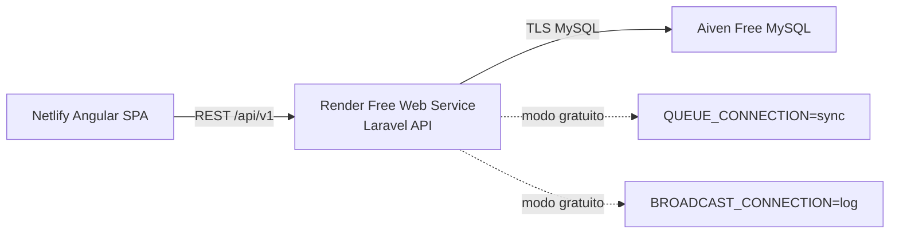

# Deploy gratuito: Render + Aiven

Este perfil publica a API Laravel no Render Free Web Service e usa Aiven Free MySQL como banco gerenciado. Ele prioriza ter uma API publica funcional para o portfolio; filas e realtime ficam em modo degradado no plano gratuito.

## Arquitetura



## 1. Criar o MySQL na Aiven

1. Crie um projeto na Aiven.
2. Crie um servico **Aiven for MySQL** no plano Free.
3. No painel do servico, copie:
   - host
   - port
   - database
   - user
   - password
   - CA certificate

O CA certificate deve ser colado no Render como variavel `AIVEN_CA_PEM`. O container escreve esse conteudo em `/tmp/aiven-ca.pem` e exporta `MYSQL_ATTR_SSL_CA` antes do cache de configuracao do Laravel.

## 2. Criar a API no Render

1. No Render, crie um novo **Blueprint** apontando para `LuanTrindade95/NexusReserve`.
2. Use o arquivo `render.yaml` na raiz.
3. Preencha os secrets solicitados:

| Variavel | Valor |
|---|---|
| `APP_KEY` | resultado de `php artisan key:generate --show` |
| `APP_URL` | URL publica do Render, exemplo `https://nexusreserve-api.onrender.com` |
| `DB_HOST` | host MySQL da Aiven |
| `DB_PORT` | porta MySQL da Aiven |
| `DB_DATABASE` | database MySQL da Aiven |
| `DB_USERNAME` | user MySQL da Aiven |
| `DB_PASSWORD` | password MySQL da Aiven |
| `AIVEN_CA_PEM` | conteudo completo do CA certificate da Aiven |

Na primeira publicacao, mantenha:

```text
RUN_MIGRATIONS=true
RUN_SEEDERS=false
```

Para popular os usuarios demo, rode uma unica vez com `RUN_SEEDERS=true`, aguarde o deploy concluir e volte para `false`. Nao mantenha seeders ligados continuamente em producao.

## 3. Configurar o frontend no Netlify

Depois que a API responder em `/up`, configure no Netlify:

```text
NEXUS_API_BASE_URL=https://SUA-API-RENDER.onrender.com/api/v1
NEXUS_REVERB_APP_KEY=
```

Com `NEXUS_REVERB_APP_KEY` vazio, o cliente Echo nao tenta abrir WebSocket. Isso evita erro de socket enquanto o plano gratuito estiver sem Reverb publico.

## 4. Smoke test

```bash
curl https://SUA-API-RENDER.onrender.com/up

curl -X POST https://SUA-API-RENDER.onrender.com/api/v1/auth/login \
  -H "Accept: application/json" \
  -d email=admin@demo \
  -d password=password
```

## Limites do plano gratuito

- Render Free Web Service pode dormir apos inatividade, causando cold start no primeiro acesso.
- Horizon nao roda como worker separado neste perfil; `QUEUE_CONNECTION=sync` executa notificacoes no request.
- Reverb nao roda neste perfil; `BROADCAST_CONNECTION=log` preserva a API sem realtime.
- Para uma demo mais fiel a producao, evolua para worker separado, Redis/Valkey e Reverb publico.
